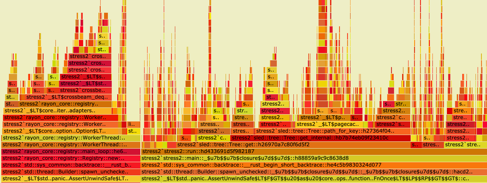

# [cargo-]flamegraph

[](example.svg)

A Rust-powered flamegraph generator with additional support for
Cargo projects! It can be used to profile anything,
not just Rust projects! No perl or pipes required <3

How to use flamegraphs: [what's a flamegraph, and how can I use it to guide systems performance work?](#systems-performance-work-guided-by-flamegraphs)

> [!TIP]
> You might want to also try [samply](https://github.com/mstange/samply), which provides a more interactive UI
> using a seamless integration with Firefox's Profiler web UI. It is also written in Rust and has better macOS support.

Relies on perf on linux and dtrace otherwise. Built on top of [@jonhoo's](https://github.com/jonhoo)
wonderful [Inferno](https://github.com/jonhoo/inferno) all-rust flamegraph generation library!
Windows is getting [dtrace support](https://techcommunity.microsoft.com/t5/Windows-Kernel-Internals/DTrace-on-Windows/ba-p/362902),
so if you try this out please let us know how it goes. :D

**Note**: If you're using lld or mold on Linux, you must use the `--no-rosegment` flag. Otherwise perf will not be able to generate accurate stack traces ([explanation](https://crbug.com/919499#c16)). For example, for lld:

```toml
[target.x86_64-unknown-linux-gnu]
linker = "/usr/bin/clang"
rustflags = ["-Clink-arg=-fuse-ld=lld", "-Clink-arg=-Wl,--no-rosegment"]
```

and for mold:

```toml
[target.x86_64-unknown-linux-gnu]
linker = "clang"
rustflags = ["-Clink-arg=-fuse-ld=/usr/local/bin/mold", "-Clink-arg=-Wl,--no-rosegment"]
```

## Installation

```
cargo install flamegraph
```

This will make the `flamegraph` and
`cargo-flamegraph` binaries available in your cargo
binary directory. On most systems this is
usually something like `~/.cargo/bin`.

Requirements on Linux:

#### Debian (x86 and aarch)
**Note**: Debian bullseye (the current stable version as of 2022) packages an outdated version of Rust which does not meet flamegraph's requirements. You should use [rustup](https://rustup.rs/) to install an up-to-date version of Rust, or upgrade to Debian bookworm (the current testing version) or newer.

```bash
sudo apt install -y linux-perf
```

#### Ubuntu (x86)
Not working on aarch, use a Debian distribution, or make a PR with your solution for Ubuntu
```bash
sudo apt install linux-tools-common linux-tools-generic linux-tools-`uname -r`
```

#### Ubuntu/Ubuntu MATE (Raspberry Pi)
```bash
sudo apt install linux-tools-raspi
```

#### Pop!_OS
```bash
sudo apt install linux-tools-common linux-tools-generic
```

## Shell auto-completion

At the moment, only `flamegraph` supports auto-completion. Supported shells are `bash`, `fish`, `zsh`, `powershell` and `elvish`.
`cargo-flamegraph` does not support auto-completion because it is not as straight-forward to implement for custom cargo subcommands. See [#153](https://github.com/flamegraph-rs/flamegraph/pull/153) for details.

How you enable auto-completion depends on your shell, e.g.
```bash
flamegraph --completions bash > $XDG_CONFIG_HOME/bash_completion # or /etc/bash_completion.d/
```

## Examples

```bash
# if you'd like to profile an arbitrary executable:
flamegraph [-o my_flamegraph.svg] -- /path/to/my/binary --my-arg 5

# or if the executable is already running, you can provide the PID via `-p` (or `--pid`) flag:
flamegraph [-o my_flamegraph.svg] --pid 1337

# NOTE: By default, perf tries to compute which functions are
# inlined at every stack frame for every sample. This can take
# a very long time (see https://github.com/flamegraph-rs/flamegraph/issues/74).
# If you don't want this, you can pass --no-inline to flamegraph:
flamegraph --no-inline [-o my_flamegraph.svg] /path/to/my/binary --my-arg 5

# cargo support provided through the cargo-flamegraph binary!
# defaults to profiling cargo run --release
cargo flamegraph

# by default, `--release` profile is used,
# but you can override this:
cargo flamegraph --dev

# if you'd like to profile a specific binary:
cargo flamegraph --bin=stress2

# if you want to pass arguments as you would with cargo run:
cargo flamegraph -- my-command --my-arg my-value -m -f

# if you want to use interesting perf or dtrace options, use `-c`
# this is handy for correlating things like branch-misses, cache-misses,
# or anything else available via `perf list` or dtrace for your system
cargo flamegraph -c "record -e branch-misses -c 100 --call-graph lbr -g"

# Run criterion benchmark
# Note that the last --bench is required for `criterion 0.3` to run in benchmark mode, instead of test mode.
cargo flamegraph --bench some_benchmark --features some_features -- --bench

cargo flamegraph --example some_example --features some_features

# Profile unit tests.
# Note that a separating `--` is necessary if `--unit-test` is the last flag.
cargo flamegraph --unit-test -- test::in::package::with::single::crate
cargo flamegraph --unit-test crate_name -- test::in::package::with::multiple:crate
cargo flamegraph --unit-test --dev test::may::omit::separator::if::unit::test::flag::not::last::flag

# Profile integration tests.
cargo flamegraph --test test_name
```

## Usage

`flamegraph` is quite simple. `cargo-flamegraph` is more sophisticated:

```
Usage: cargo flamegraph [OPTIONS] [-- <TRAILING_ARGUMENTS>...]

Arguments:
  [TRAILING_ARGUMENTS]...  Trailing arguments passed to the binary being profiled

Options:
      --dev                            Build with the dev profile
      --profile <PROFILE>              Build with the specified profile
  -p, --package <PACKAGE>              package with the binary to run
  -b, --bin <BIN>                      Binary to run
      --example <EXAMPLE>              Example to run
      --test <TEST>                    Test binary to run (currently profiles the test harness and all tests in the binary)
      --unit-test [<UNIT_TEST>]        Crate target to unit test, <unit-test> may be omitted if crate only has one target (currently profiles the test harness and all tests in the binary; test selection can be passed as trailing arguments after `--` as separator)
      --bench <BENCH>                  Benchmark to run
      --manifest-path <MANIFEST_PATH>  Path to Cargo.toml
  -f, --features <FEATURES>            Build features to enable
      --no-default-features            Disable default features
  -r, --release                        No-op. For compatibility with `cargo run --release`
  -v, --verbose                        Print extra output to help debug problems
  -o, --output <OUTPUT>                Output file [default: flamegraph.svg]
      --open                           Open the output .svg file with default program
      --root                           Run with root privileges (using `sudo`)
  -F, --freq <FREQUENCY>               Sampling frequency in Hz [default: 997]
  -c, --cmd <CUSTOM_CMD>               Custom command for invoking perf/dtrace
      --deterministic                  Colors are selected such that the color of a function does not change between runs
  -i, --inverted                       Plot the flame graph up-side-down
      --reverse                        Generate stack-reversed flame graph
      --notes <STRING>                 Set embedded notes in SVG
      --min-width <FLOAT>              Omit functions smaller than <FLOAT> pixels [default: 0.01]
      --image-width <IMAGE_WIDTH>      Image width in pixels
      --palette <PALETTE>              Color palette [possible values: hot, mem, io, red, green, blue, aqua, yellow, purple, orange, wakeup, java, perl, js, rust]
      --skip-after <FUNCTION>          Cut off stack frames below <FUNCTION>; may be repeated
      --flamechart                     Produce a flame chart (sort by time, do not merge stacks)
      --ignore-status                  Ignores perf's exit code
      --no-inline                      Disable inlining for perf script because of performance issues
      --post-process <POST_PROCESS>    Run a command to process the folded stacks, taking the input from stdin and outputting to stdout
  -h, --help                           Print help
  -V, --version                        Print version
```

Then open the resulting `flamegraph.svg` with a browser, because most image
viewers do not support interactive svg-files.

## Enabling perf for use by unprivileged users

To enable perf without running as root, you may
lower the `perf_event_paranoid` value in proc
to an appropriate level for your environment.
The most permissive value is `-1` but may not
be acceptable for your security needs etc...

```bash
echo -1 | sudo tee /proc/sys/kernel/perf_event_paranoid
```

### DTrace on macOS

On macOS, there is no alternative to running as superuser in order to
enable DTrace. This should be done by invoking `sudo flamegraph ...` or
`cargo flamegraph --root ...`. Do not do `sudo cargo flamegraph ...`;
this can cause problems due to Cargo's build system being run as root.

Be aware that if the binary being tested is user-aware, this does
change its behaviour.

## Improving output when running with `--release`

Due to optimizations etc... sometimes the quality
of the information presented in the flamegraph will
suffer when profiling release builds.

To counter this to some extent, you may either set the following in your
`Cargo.toml` file:

```
[profile.release]
debug = true
```

Or set the environment variable [CARGO_PROFILE_RELEASE_DEBUG=true](https://doc.rust-lang.org/cargo/reference/config.html#profilenamedebug).

Please note that tests, unit tests and benchmarks use the `bench` profile in release mode (see [here](https://doc.rust-lang.org/cargo/reference/profiles.html#profile-selection)).


## Usage with benchmarks

In order to perf existing benchmarks, you should set up a few configs.
Set the following in your `Cargo.toml` file to run benchmarks:

```
[profile.bench]
debug = true
```


## Use custom paths for perf and dtrace

If `PERF` or `DTRACE` environment variable is set,
it'll be used as corresponding tool command.
For example, to use `perf` from `~/bin`:

```bash
env PERF=~/bin/perf flamegraph /path/to/my/binary
```

## Use custom `addr2line` binary for perf

It has been reported that `addr2line` can run very slowly in several issues ([#74][i74], [#199][i199], [#294][i294]). One solution is to use [gimli-rs/addr2line](https://github.com/gimli-rs/addr2line) instead of the system `addr2line` binary. This is suggested in [this comment](https://github.com/flamegraph-rs/flamegraph/issues/74#issuecomment-1909417039), and you can follow the steps below to set it up:

[i74]: https://github.com/flamegraph-rs/flamegraph/issues/74
[i199]: https://github.com/flamegraph-rs/flamegraph/issues/199
[i294]: https://github.com/flamegraph-rs/flamegraph/issues/294

1. Clone the `addr2line` repository:

   ```bash
   git clone https://github.com/gimli-rs/addr2line
   cd addr2line
   ```

2. Build the `addr2line` binary with the `bin` feature enabled:

   ```bash
   cargo build --release --bin addr2line --features bin
   ```

3. Add the binary to your `PATH` for the current session:

   ```bash
   export PATH="$PWD/target/release:$PATH"
   ```

   Note: This `export` is not persistent across shell sessions. You can either run it again as needed or set up a shell alias for convenience.

### Persistent Setup with Shell Alias

To avoid having to run the `export` command each time, you can set up a shell alias by adding the following to your shell configuration file (e.g., `.bashrc` or `.zshrc`):

```bash
ADDR2LINE_HOME=/path/to/addr2line
alias flamegraph="PATH=$ADDR2LINE_HOME/target/release:$PATH flamegraph"

cargo() {
  if [ "$1" = "flamegraph" ]; then
    PATH=$ADDR2LINE_HOME/target/release:$PATH cargo "$@"
  else
    cargo "$@"
  fi
}
```

Replace `/path/to/addr2line` with the actual path where you cloned `gimli-rs/addr2line`. This will ensure that `flamegraph` and `cargo flamegraph` always use the custom `addr2line` binary.

[i74]: https://github.com/flamegraph-rs/flamegraph/issues/74
[i199]: https://github.com/flamegraph-rs/flamegraph/issues/199
[i294]: https://github.com/flamegraph-rs/flamegraph/issues/294

# Systems Performance Work Guided By Flamegraphs

Flamegraphs are used to visualize where time is being spent
in your program. Many times per second, the threads in a
program are interrupted and the current location in your
code (based on the thread's instruction pointer) is recorded,
along with the chain of functions that were called to get there.
This is called stack sampling. These samples are then
processed and stacks that share common functions are
added together. Then an SVG is generated showing the
call stacks that were measured, widened to the proportion
of all stack samples that contained them.

The **y-axis** shows the stack depth number. When looking at a
flamegraph, the main function of your program will be closer to
the bottom, and the called functions will be stacked on top,
with the functions that they call stacked on top of them, etc...

The **x-axis** spans all of the samples. It does *not* show the
passing of time from left to right. The left to right ordering
has no meaning.

The **width** of each box shows the total time that that
function is on the CPU or is part of the call stack. If a
function's box is wider than others, that means that it consumes
more CPU per execution than other functions, or that it is
called more than other functions.

The **color** of each box isn't significant, and is chosen at
random.

Flamegraphs are good for visualizing where the most
expensive parts of your program are at runtime,
which is wonderful because...

## Humans are terrible at guessing about performance!

Especially people who come to Rust from C and C++ will
often over-optimize things in code that LLVM is able to
optimize away on its own. It's always better to write
Rust in a clear and obvious way, before beginning
micro-optimizations, allocation-minimization, etc...

Lots of things that would seem like they would have terrible
performance are actually cheap or free in Rust. Closures
are fast. Initialization on the stack before moving
to a `Box` is often compiled away. Clones are often
compiled away. So, `clone()` away instead of fighting
for too long to get the compiler to be happy about
ownership!

Then make a flamegraph to see if any of that was
actually expensive.

## Flamegraphs Are the Beginning, Not the End

Flamegraphs show you the things that are taking up time, but they
are a sampling technique to be used for high-level and initial
looks at the system under measurement. They are great for finding
the things to look into more closely, and often it will be
obvious how to improve something based on its flamegraph, but
they are really more for choosing the target to perform optimization
on than an optimization measurement tool in itself. They are
coarse-grained, and difficult to diff (although
[this may be supported soon](https://github.com/jonhoo/inferno/issues/62)).
Also, because flamegraphs are based on the proportion of total time
that something takes, if you accidentally make something else
really slow, it will show all other things as smaller on the flamegraph,
even though the entire program runtime is much slower, the items you
were hoping to optimize look smaller.

It is a good idea to use Flamegraphs to figure out what you want to
optimize, and then set up a measurement environment that allows
you to determine that an improvement has actually happened.

* use flamegraphs to find a set of optimization targets
* create benchmarks for these optimization targets, and if
appropriate use something like cachegrind and cg_diff to
[measure cpu instructions](https://github.com/spacejam/sled/blob/d521c510c3b8a7e02b8602d6db6a7701b51bd33b/hack/instructions#L26)
and diff them against the previous version.
* Measuring CPU instructions is often better than measuring the time it takes
to run a workload in many cases, because it's possible that a
background task on your machine ran and caused something to slow down
in terms of physical time, but if you actually made an implementation
faster, it is likely to have a stronger correlation with reduced total
CPU instructions.
* Time spent on the CPU is not the full picture, as time is spent
waiting for IO to complete as well, which does not get accounted
with tools like perf that only measure what's consuming time
on the CPU. Check out [Brendan Gregg's article on Off-Cpu
Accounting](http://www.brendangregg.com/offcpuanalysis.html)
for more information about this!

## Performance Theory 101: Basics of Quantitative Engineering

* Use realistic workloads on realistic hardware, or your data doesn't
necessarily correspond very much with what will be happening in production
* All of our guesses are wrong to some extent, so we have to measure
the effects of our work. Often the simple code that doesn't seem
like it should be fast is actually way faster than code that looks
optimized. We need to measure our optimizations to make sure that we
didn't make our code both harder to read AND slower.
* Measure before you change anything, and save the results
in a safe place! Many profiling tools will overwrite their old output
when you run them again, so make sure you take care to save the
data before you begin so that you can compare before and after.
* Take measurements on a warmed up machine that isn't doing anything
else, and has had time to cool off from the last workload.
CPUs will fall asleep and drop into power-saving modes when idle,
and they will also throttle if they get too hot (sometimes SIMD
can cause things to run slower because it heats things up so much
that the core has to throttle).

## Performance Theory 202: USE Method

The USE Method is a way to very quickly locate performance
problems while minimizing discovery efforts. It's more about
finding production issues than flamegraphs directly, but it's
a great technique to have in your toolbox if you are going to
be doing performance triage, and flamegraphs can be helpful
for identifying the components to then drill down into queue
analysis for.

Everything in a computer can be thought of as a resource
with a queue in front of it, which can serve one or more
requests at a time. The various systems in our computers
and programs can do a certain amount of work over time
before requests start to pile up and wait in a line
until they are able to be serviced.

Some resources can handle more and more work without degrading
in performance until they hit their maximum utilization point.
Network devices can be thought of as working in this way to
a large extent. Other resources start to saturate long before
they hit their maximum utilization point, like disks.

Disks (especially spinning disks, but even SSDs) will do more and
more work if you allow more work to queue up until they hit their
maximum throughput for a workload, but the latency per request
will go up before it hits 100% utilization because the disk will
take longer before it can begin servicing each request. Tuning disk
performance often involves measuring the various IO queue depths to
make sure they are high enough to get nice throughput but not so
high that latency becomes undesirable.

Anyway, nearly everything in our systems can be broken down
to be analyzed based on 3 high-level characteristics:

* **Utilization** is the amount of time the system under
measurement is actually doing useful work servicing a request,
and can be measured as the percent of available time spent servicing
requests
* **Saturation** is when requests have to wait before being
serviced. This can be measured as the queue depth over time
* **Errors** are when things start to fail, like when queues
are no longer able to accept any new requests - like when a TCP connection
is rejected because the system's TCP backlog is already full of
connections that have not yet been accept'ed by the userspace
program.

This forms the necessary background to start applying the USE Method
to locate the performance-related issue in your complex system!

The approach is:
1. Enumerate the various resources that might be behaving poorly - maybe by creating a
flamegraph and looking for functions that are taking more of the total runtime than expected
1. Pick one of them
1. (Errors) Check for errors like TCP connection failures, other IO failures, bad things in logs etc...
1. (Utilization) Measure the utilization of the system and see if its throughput is approaching
the known maximum, or the point that it is known to experience saturation
1. (Saturation) Is saturation actually happening? Are requests waiting in lines before being serviced?
Is latency going up while throughput is staying the same?

These probing questions serve as a piercing flashlight for
rapidly identifying the underlying issue most of the time.

If you want to learn more about this, check out Brendan Gregg's
[blog post](http://www.brendangregg.com/usemethod.html) on it.
I tend to recommend that anyone who is becoming an SRE should
make Brendan's
[Systems Performance](http://www.brendangregg.com/sysperfbook.html)
book one of the first things they read to understand how to
measure these things quickly in production systems.

The USE Method derives from an area of study called
[queue theory](https://en.wikipedia.org/wiki/Queueing_theory)
which has had a huge impact on the world of computing,
as well as many other logistical endeavors that humans
have undertaken.

## Performance Laws

If you want to drill more into theory, know the law(s)!

* [Universal Law of Scalability](http://www.perfdynamics.com/Manifesto/USLscalability.html)
is about the relationship between concurrency gains, queuing and coordination costs
* [Amdahl's Law](https://en.wikipedia.org/wiki/Amdahl%27s_law)
is about the theoretical maximum gain that can be made for a workload by parallelization.
* [Little's Law](https://en.wikipedia.org/wiki/Little%27s_law)
is a deceptively simple law with some subtle implications from queue theory
that allows us to reason about appropriate queue lengths for our systems
